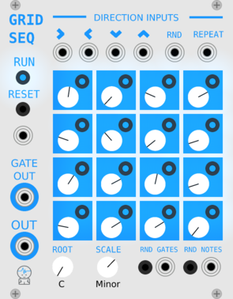

# JW-Modules

Modules for VCV Rack from https://vcvrack.com/ 

by [@jeremywen](https://twitter.com/jeremywen)

[Donate Here](https://www.paypal.me/jeremywen)

## GridSeq

[Video](https://www.youtube.com/watch?v=Bnxzqi5jwcU)

#### 16 Step Sequencer

When a direction input is sent a trigger and a cell is entered, a pitch will be sent to the OUT port if the cell's gate is on.

#### Top Direction Inputs 

  *  **Right Arrow:** on trigger move right one cell and send out value if gate is on for that cell
  *  **Left Arrow:** on trigger move left one cell and send out value if gate is on for that cell
  *  **Down Arrow:** on trigger move down one cell and send out value if gate is on for that cell
  *  **Up Arrow:** on trigger move up one cell and send out value if gate is on for that cell
  *  **RND:** on trigger move one cell in a random direction and send out value if gate is on for that cell
  *  **REPEAT:**  stay on current cell and send out value if gate is on for that cell

#### Left

  *  **RUN:** values are sent to outputs if running
  *  **RESET Button:** move to top left cell on click
  *  **RESET Input:** move to top left cell on trigger
  *  **GATE OUT:** sends out gate if current cell gate is on and sequencer is running
  *  **OUT:** sends out the current value (pitch knob) for the current cell if the gate is on and sequencer is running

#### Bottom

  *  **ROOT:** root note if scaling pitch sent to "OUT"
  *  **SCALE:** current musical scale or none if turned up all the way to the last value
  *  **RND GATES Button** randomize gate only for each cell
  *  **RND GATES Input** on trigger randomize gate only for each cell
  *  **RND NOTES Button** randomize pitch only for each cell
  *  **RND NOTES Input** on trigger, randomize pitch only for each cell (NOTE: knobs don't update on 'random notes' cv in. If you want knobs to update after cv into 'random notes', right click the random notes button.)

## SimpleClock

[Video](https://www.youtube.com/watch?v=DCustAy7xVc)

#### Knobs 

  *  **Clock knob:** determines speed of clock

  *  **Random Reset knob:** If down all the way, this does nothing.  If turned up, the chances of sending out a reset trigger on a clock step is increased.

#### Outputs

  *  **Clock output:** Clock sends out a trigger at a certain interval based on the clock knob position.

  *  **Reset output:** trigger is sent out when the clock is started by clicking 'run' or if random reset knob is turned up

## FullScope

Scope in lissajous mode which takes up the full width and height of the module.  Credit goes to Andrew Belt for the Fundamental:Scope code.  I just modied that code slightly.

  * Inputs in bottom left corner
    * X input (same as Fundamental Scope)
    * Y input (same as Fundamental Scope)
    * Color input
    * Time input
  * Knobs in bottom right corner (same knobs exist in Fundamental Scope)
    * X Position
    * Y Position
    * X Scale
    * Y Scale
    * Time

## RMS

Created to show RMS in a larger font than the Fundamental Scope 

## Building

Compile Rack from source, following the instructions at https://github.com/VCVRack/Rack.

Check out JW-Modules into the `plugins/` directory

Then run:

	make

To make plugin zip:

	make dist
	zip -r JW-Modules.zip dist/JW-Modules

