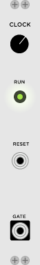

# JW-Modules

Modules for VCV Rack from https://vcvrack.com/ 

## Building

Compile Rack from source, following the instructions at https://github.com/VCVRack/Rack.

Check out JW-Modules into the `plugins/` directory

Then run:

	make

## Modules

SimpleClock

