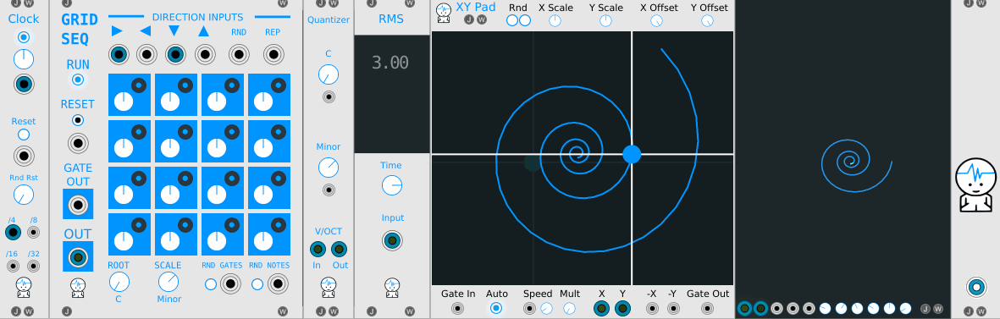
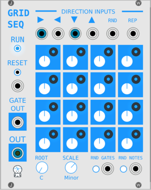
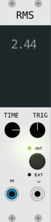

# JW-Modules

### [Download the Latest Release Here](https://github.com/jeremywen/JW-Modules/releases)

Modules for VCV Rack from https://vcvrack.com/ 

by [@jeremywen](https://twitter.com/jeremywen)

[Donate through Paypal](https://www.paypal.me/jeremywen)

[Donate through Patreon](https://www.patreon.com/jeremywen)

## GridSeq

[Video](https://www.youtube.com/watch?v=Bnxzqi5jwcU)

#### 16 Step Sequencer

When a direction input is sent a trigger and a cell is entered, a pitch will be sent to the OUT port if the cell's gate is on.

#### Top Direction Inputs 

  *  **Right Input:** on trigger move right one cell and send out value if gate is on for that cell
  *  **Left Input:** on trigger move left one cell and send out value if gate is on for that cell
  *  **Down Input:** on trigger move down one cell and send out value if gate is on for that cell
  *  **Up Input:** on trigger move up one cell and send out value if gate is on for that cell
  *  **RND:** on trigger move one cell in a random direction and send out value if gate is on for that cell
  *  **REPEAT:**  stay on current cell and send out value if gate is on for that cell

  **NOTE 1:** You can click the arrows or words above the inputs to trigger them.

#### Left

  *  **RUN:** values are sent to outputs if running
  *  **RESET Button:** move to top left cell on click
  *  **RESET Input:** move to top left cell on trigger
  *  **GATE OUT:** sends out gate if current cell gate is on and sequencer is running
  *  **OUT:** sends out the current value (pitch knob) for the current cell if the gate is on and sequencer is running

#### Bottom

  *  **ROOT Knob:** root note if scaling pitch sent to "OUT"
  *  **SCALE Knob:** current musical scale or none if turned up all the way to the last value
  *  **RND GATES Button** randomize gate only for each cell
  *  **RND GATES Input** on trigger randomize gate only for each cell
  *  **RND NOTES Button** randomize pitch only for each cell
  *  **RND NOTES Input** on trigger, randomize pitch only for each cell (NOTE: knobs don't update on 'random notes' cv in. If you want knobs to update after cv into 'random notes', right click the random notes button.)

#### Right Click Context Menu

  

  * **Trigger:** same as SEQ3
  * **Retrigger:** same as SEQ3
  * **Continuous:** same as SEQ3
  * **Ignore Gate for V/OCT Out:** If you want the pitch to continue changing even if the gates are not on, you can right click the module and check 
  'Ignore Gate for V/OCT Out'.  This can create interesting effects, for example, when gate is triggering an envelope with a long release.

## XY Pad

[Video](https://www.youtube.com/watch?v=SF0lwKFIXqo)

Draw your own LFO.  The recorded path is saved and opened.

#### Top
  
  *  **Rnd Left Button:** will cycle through different types of designs and generate random ones
  *  **Rnd Right Button:** random variation of the last design will be generated (so click the left button until you find one you like, then click the right button to make a variation of that one.)
  *  **X Scale Knob:** multiplies x output by a value between 0.01 and 1.0
  *  **Y Scale Knob:** multiplies y output by a value between 0.01 and 1.0
  *  **X Offset Knob:** +/- 5v added to X Output
  *  **Y Offset Knob:** +/- 5v added to Y Output

#### Bottom
  
  *  **Gate In:** plays recorded path while gate is high, retriggers on new gate
  *  **Auto:** loops playback of the recorded path right after releasing the mouse button
      * Or if you just performed a motion while Auto was off, turning it on will play it back
      * Or if Auto is on and you want to stop playback, turn Auto off
  *  **Speed:** plays recorded path from 1x up to 10x faster
  *  **Mult:** multiplies the current speed by larger amounts
  *  **X Output:** +/- 5v based on x position
  *  **Y Output:** +/- 5v based on y position
  *  **-X:** +/- 5v based on inverted x position (darker crosshairs)
  *  **-Y:** +/- 5v based on inverted y position (darker crosshairs)
  *  **Gate Out:** 10v gate out while mouse pressed

#### Right Click Context Menu

Change the playback mode by right clicking the module and selecting of of the playback options:

## SimpleClock

[Video](https://www.youtube.com/watch?v=DCustAy7xVc)

#### Knobs 

  *  **Clock knob:** determines speed of clock

  *  **Random Reset knob:** If down all the way, this does nothing.  If turned up, the chances of sending out a reset trigger on a clock step is increased.

#### Outputs

  *  **Clock output:** Clock sends out a trigger at a certain interval based on the clock knob position.

  *  **Reset output:** trigger is sent out when the clock is started by clicking 'run' or if random reset knob is turned up

## Quantizer

  *  **Root Knob:** root note if scaling pitch sent to "OUT"
  *  **Scale Knob:** current musical scale or none if turned up all the way to the last value

## FullScope

Scope in lissajous mode which takes up the full width and height of the module.  Credit goes to Andrew Belt for the [Fundamental:Scope](https://github.com/VCVRack/Fundamental/blob/v0.4.0/src/Scope.cpp) code.  I just modied that code slightly.

  * Inputs in bottom left corner
    * X input (same as Fundamental Scope)
    * Y input (same as Fundamental Scope)
    * Color input
    * Rotation input
    * Time input
  * Knobs in bottom right corner (same knobs exist in Fundamental Scope)
    * X Position
    * Y Position
    * X Scale
    * Y Scale
    * Rotation
    * Time

## RMS

Created to show RMS in a larger font than the Fundamental Scope 

## WaveHead

Move WavHead up and down based on voltage in.  Right click to invert direction or change to bidirectional -5 to +5 volts.

## Building

Compile Rack from source, following the instructions at https://github.com/VCVRack/Rack.

Check out JW-Modules into the `plugins/` directory

Then run:

	make

To make plugin zip:

	make dist
	zip -r JW-Modules.zip dist/JW-Modules

