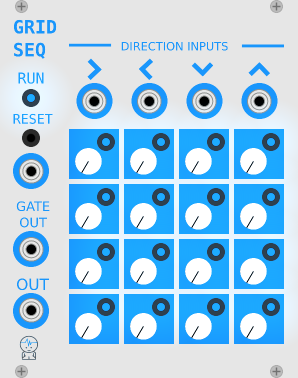

# JW-Modules

Modules for VCV Rack from https://vcvrack.com/ 

by [@jeremywen](https://twitter.com/jeremywen)

[Donate](https://www.paypal.me/jeremywen)

## Building

Compile Rack from source, following the instructions at https://github.com/VCVRack/Rack.

Check out JW-Modules into the `plugins/` directory

Then run:

	make

To make plugin zip:

	make dist
	zip -r JW-Modules.zip dist/JW-Modules

## Modules

GridSeq

[Video](https://www.youtube.com/watch?v=Bnxzqi5jwcU)

SimpleClock

[Video](https://www.youtube.com/watch?v=DCustAy7xVc)

