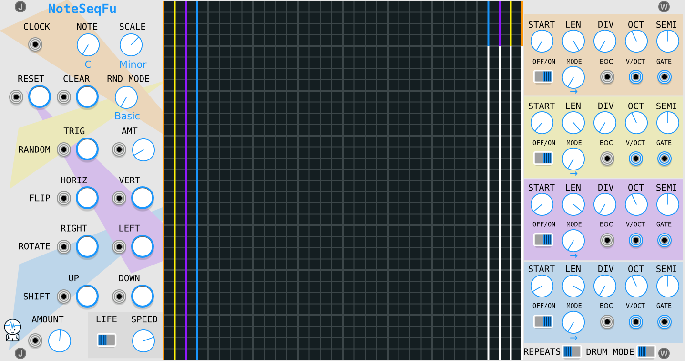
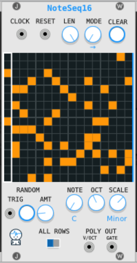
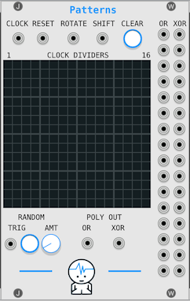
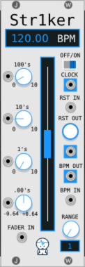
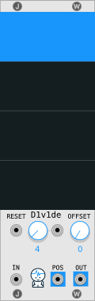
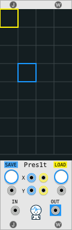

# JW-Modules

`	           d(-_-)b        Useful, Musical, and Fun     ¯\_(ツ)_/¯`

Modules for [VCV Rack](https://vcvrack.com/) by [Jeremy Wentworth](https://linktr.ee/jeremyw)

Add JW-Modules through [the vcv library](https://library.vcvrack.com/?query=&brand=JW-Modules&tag=&license=).

Support me on [Patreon](https://www.patreon.com/jeremywen) or make a one time donation with [Paypal](https://www.paypal.me/jeremywen)


----
## Table of Contents:

* [Thing Thing](#thing-thing)
* [NoteSeq](#noteSeq)
* [NoteSeqFu](#noteSeqFu)
* [NoteSeq16](#noteSeq16)
* [Patterns](#patterns)
* [Bouncy Balls](#bouncy-balls)
* [GridSeq](#gridseq)
* [XY-Pad](#xy-pad)
* [SimpleClock](#simpleclock)
* [Str1ker](#str1ker)
* [D1v1de](#d1v1de)
* [Pres1t](#pres1t)
* [Quantizer](#quantizer)
* [FullScope](#fullscope)
* [MinMax](#minmax)
* [WavHead](#wavhead)

----


## Thing Thing


 * inputs 1 through 4 are +/-5v
 * 5th input and knob are the BALL size uh huh huh :)
 * 6th input and knob zoOM in
 * pairs well with the angle outputs on [Vult Modules Caudal](https://modlfo.github.io/VultModules/caudal/)

## NoteSeq


#### Basics

* Left side of module is for sequencer control, generation, and modification.
* Right side of module is mainly for controlling the outputs.
* You can click and drag cells in the grid to toggle them on and off.
* Here is a video of a [patch from init](https://www.youtube.com/watch?v=P6cNFfb0w1s)

#### Left

*  **Clock Input:** when source sends a trigger, the sequence moves to the next step
*  **Step Button:** when clicked, the sequence moves to the next step
*  **Length Knob:** the sequence length indicated by the vertical purple line
*  **Mode:** the play mode changes how it moved through a sequence
*  **Reset Input and Button:** resets to first step in sequence (based on the play mode)
*  **Clear Input and Button:** clears the grid
*  **RND Mode:** changes what happens when you trigger the random input or button 
*  **Random Trig Input and Button:** clears the grid and generates random notes (based on the rnd mode)
*  **Random Amount Input and Knob:** determines how full the grid will be when generating random notes
*  **Shift Up Trig Input and Button:** moves the cells in the grid the number of rows set by the amount knob (notes wrap around to the bottom)
*  **Shift Down Trig Input and Button:** moves the cells in the grid down the number of rows set by the amount knob (notes wrap around to the top)
*  **Shift Amount Knob:** determines how much to shift the cells
*  **Rotate Right Input and Button:** rotates the cells in the grid clockwise 90 degrees
*  **Rotate Left Input and Button:** rotates the cells in the grid counter-clockwise 90 degrees
*  **Flip Horiz Input and Button:** flips the cells in the grid right to left
*  **Flip Vert Input and Button:** flips the cells in the grid top to bottom
*  **Life Switch:** when switched to the right this turns on [conway's game of life](https://en.wikipedia.org/wiki/Conway%27s_Game_of_Life)
*  **Life Speed Knob:** determines how fast to iterate the game of life (clock divided based on clock input)

#### Right

*  **Individual Poly Outputs:** Send out the lowest 16 active notes up from the 'Lowest Note' OR send out the lowest 16 rows up from the 'Lowest Note'.  This is based on the 'Drum Mode Switch' (See Below).  The lights indicate which outputs are sending out values.
*  **Mono Outputs:** can be used to select one note from a column of many notes.
*  **Highest Note Knob:** will set the orange line right above the highest note sent out the poly outputs.
*  **Lowest Note Knob:** will set the yellow line right below the lowest note sent out the poly outputs.
*  **Drum Mode Switch:** [Demo Video](https://www.youtube.com/watch?v=EkFzYxhhn-g) When switched to the right, even if the note isn't 'active'(turned on) then the outputs still directly line up to the 16 lowest notes. 
So for example, you can program a drum beat with a kick at the lowest note and a snare on the 4th row up then connect your outputs to the lowest output and the 4th 
output row up and they will work more like a midi sequencer. When 'Drum Mode' is switched to the left it grabs the 16 lowest notes which are 'active'.
*  **Octave Knob:** octave for the lowest note in the grid
*  **Note Knob:** root note if scaling pitch sent to "OUT"
*  **Scale Knob:** current musical scale or none if turned up all the way to the last value
*  **EOC Output:** at the end of the loop it will send out a trigger
*  **Poly Outputs:** v/oct and gate as a polyphonic signal

## NoteSeqFu



#### Basics

* Left side of module is for sequencer control, generation, and modification.
* Right side of module is mainly for controlling the play heads and outputs.
* You can click and drag cells in the grid to toggle them on and off.

#### Left

*  **Clock Input:** when source sends a trigger, the sequence moves to the next step
*  **Step Button:** when clicked, the sequence moves to the next step
*  **Length Knob:** the sequence length indicated by the vertical purple line
*  **Note Knob:** root note if scaling pitch sent to "OUT"
*  **Scale Knob:** current musical scale or none if turned up all the way to the last value
*  **Reset Input and Button:** resets to first step in sequence (based on the play mode)
*  **Clear Input and Button:** clears the grid
*  **RND Mode:** changes what happens when you trigger the random input or button 
*  **Random Trig Input and Button:** clears the grid and generates random notes (based on the rnd mode)
*  **Random Amount Input and Knob:** determines how full the grid will be when generating random notes
*  **Shift Up Trig Input and Button:** moves the cells in the grid the number of rows set by the amount knob (notes wrap around to the bottom)
*  **Shift Down Trig Input and Button:** moves the cells in the grid down the number of rows set by the amount knob (notes wrap around to the top)
*  **Shift Amount Knob:** determines how much to shift the cells
*  **Rotate Right Input and Button:** rotates the cells in the grid clockwise 90 degrees
*  **Rotate Left Input and Button:** rotates the cells in the grid counter-clockwise 90 degrees
*  **Flip Horiz Input and Button:** flips the cells in the grid right to left
*  **Flip Vert Input and Button:** flips the cells in the grid top to bottom
*  **Life Switch:** when switched to the right this turns on [conway's game of life](https://en.wikipedia.org/wiki/Conway%27s_Game_of_Life)
*  **Life Speed Knob:** determines how fast to iterate the game of life (clock divided based on clock input)

#### Right

*  **Start Knob:** the start offset on reset
*  **Mode Knob:** the play mode changes how it moved through a sequence
*  **Div Knob:** the clock division to move the play head
*  **Oct Knob:** octave for the lowest note in the grid
*  **Semi Knob:** semitone offset of notes at playhead
*  **EOC Output:** at the end of the loop it will send out a trigger
*  **Poly Outputs:** v/oct and gate as a polyphonic signal
*  **Drum Mode Switch:** [Demo Video](https://www.youtube.com/watch?v=EkFzYxhhn-g) When switched to the right, even if the note isn't 'active'(turned on) then the outputs still directly line up to the 16 lowest notes. 
So for example, you can program a drum beat with a kick at the lowest note and a snare on the 4th row up then connect your outputs to the lowest output and the 4th 
output row up and they will work more like a midi sequencer. When 'Drum Mode' is switched to the left it grabs the 16 lowest notes which are 'active'.

## NoteSeq16



#### Basics

* You can click and drag cells in the grid to toggle them on and off.
* You can right+click the module to select the number of polyphonic channels.

#### Top

*  **Clock Input:** when source sends a trigger, the sequence moves to the next step
*  **Reset Input:** resets to first step in sequence (based on the play mode)
*  **Length Knob:** the sequence length indicated by the vertical purple line
*  **Mode:** the play mode changes how it moved through a sequence
*  **Clear Button:** clears the grid

#### Bottom

*  **Random Trig Input and Button:** clears the grid and generates random notes (based on the rnd mode)
*  **Random Amount Knob:** determines how full the grid will be when generating random notes
*  **Rotate:** rotates gride clockwise
*  **Flip:** flips grid vertically
*  **Shift:** shifts grid up 1 row
*  **Octave Knob:** octave for the lowest note in the grid
*  **Note Knob:** root note if scaling pitch sent to "OUT"
*  **Scale Knob:** current musical scale or none if turned up all the way to the last value
*  **Drum Mode Switch:** When switched to the right, even if the note isn't 'active'(turned on) then the outputs still directly line up to the 16 lowest notes. 
So for example, you can program a drum beat with a kick at the lowest note and a snare on the 4th row up then connect your outputs to the lowest output and the 4th 
output row up and they will work more like a midi sequencer. When 'Drum Mode' is switched to the left it grabs the 16 lowest notes which are 'active'.
*  **Poly Outs:** Send out up to 16 active notes.  This is based on the 'Drum Mode' switch. 
*  **EOC Output:** at the end of the loop it will send out a trigger

## Patterns



Here is the [post by chaircrusher that inspired Patterns](https://community.vcvrack.com/t/using-xors-with-clocks-for-rhythmic-variations/5293)

#### Basics

* Each row is a clock divider.  Each cell is a division 1 to 16, left to right.
* Each row has and 'or' output and an 'xor' output.
* The 'or' output will send a trigger if it hit any of the divisions.
* The 'xor' output will send a trigger if it hit exactly one of the divisions.
* You can click and drag cells in the grid to toggle them on and off.
* You can right+click the module to select the number of polyphonic channels.
* Ever four rows there is a thicker lines in the grid which correspond to the lines in the outputs every four rows.

#### Top

*  **Clock Input:** when source sends a trigger, advances the clock one step
*  **Reset Input:** resets to first step 
*  **Rotate Button:** rotates the grid to the right
*  **Shift Button:** shifts the grid up
*  **Clear Button:** clears the grid

#### Bottom

*  **Random Trig Input and Button:** clears the grid and generates random cells (based on the rnd mode)
*  **Random Amount Knob:** determines how full the grid will be when generating random cells
*  **Poly Outs:** Send out 'or' outputs or send out 'xor' outputs. 

## Bouncy Balls


#### Basics

* The top section contains all the inputs.
* The bottom sections contains all the outputs.
* The colors of the inputs/outputs correspond to the ball colors.
* The top two rows have buttons next to the inputs for manually triggering.
* The next three rows have knobs next to the inputs for manually controlling the values.
* Click in the dark area to lock/unlock the paddle.
* Click the 'ON' button to toggle the paddle visibility.

#### Inputs

*  **RST:** starts ball back at center with initial velocity
*  **TRIG:** speeds up ball based on velocity settings
*  **VELX:** velocity in the x direction, to the right is positive (towards east), to the left is negative (towards west)
*  **VELY:** velocity in the y direction, to the right is positive (towards south), to the left is negative (towards north)
*  **MULT:** velocity multiplier

#### Outputs

*  **X:** x position for each ball
*  **Y:** y position for each ball
*  **N:** (north) trigger out for each ball that hits the top
*  **E:** (east) trigger out for each ball that hits the right side
*  **S:** (south) trigger out for each ball that hits the bottom
*  **W:** (west) trigger out for each ball that hits the left side
*  **EDGE:** trigger out for each ball that hits any side
*  **PAD:** trigger out for each ball that hits the white pad

#### Modifying the Output Signal

*  **X Scale Knob:** multiplies x output by a value between 0.01 and 1.0
*  **Y Scale Knob:** multiplies y output by a value between 0.01 and 1.0
*  **X Offset Knob:** +/- 5v added to X Output
*  **Y Offset Knob:** +/- 5v added to Y Output

## GridSeq


[Video](https://www.youtube.com/watch?v=Bnxzqi5jwcU)

[Example Patch](./doc/gridseq-example-patch-1.png)

#### 16 Step Sequencer

When a direction input is sent a trigger and a cell is entered, a pitch will be sent to the OUT port if the cell's gate is on.

#### Top Direction Inputs 

  *  **Right Input:** on trigger move right one cell and send out value if gate is on for that cell
  *  **Left Input:** on trigger move left one cell and send out value if gate is on for that cell
  *  **Down Input:** on trigger move down one cell and send out value if gate is on for that cell
  *  **Up Input:** on trigger move up one cell and send out value if gate is on for that cell
  *  **RND:** on trigger move one cell in a random direction and send out value if gate is on for that cell
  *  **REPEAT:**  stay on current cell and send out value if gate is on for that cell

  **NOTE 1:** You can click the arrows or words above the inputs to trigger them.

#### Left

  *  **RUN:** values are sent to outputs if running
  *  **RESET Button:** move to top left cell on click
  *  **RESET Input:** move to top left cell on trigger
  *  **GATE OUT:** sends out gate if current cell gate is on and sequencer is running
  *  **GATE OUT YX:** instead of using the gate of the current cell it uses the gate of the cell at the inverted position (so if top right is current, bottom left is used)
  *  **OUT:** sends out the current value (pitch knob) for the current cell if the gate is on and sequencer is running
  *  **OUT YX:** instead of using the value of the current cell it uses the value of the cell at the inverted position (so if top right is current, bottom left is used)

#### Bottom

  *  **ROOT Knob:** root note if scaling pitch sent to "OUT"
  *  **SCALE Knob:** current musical scale or none if turned up all the way to the last value
  *  **RND GATES Button** randomize gate only for each cell
  *  **RND GATES Input** on trigger randomize gate only for each cell
  *  **RND NOTES Button** randomize pitch only for each cell
  *  **RND NOTES Input** on trigger, randomize pitch only for each cell (NOTE: knobs don't update on 'random notes' cv in. If you want knobs to update after cv into 'random notes', right click the random notes button.)

#### Right Click Context Menu

  

  * **Trigger:** same as SEQ3
  * **Retrigger:** same as SEQ3
  * **Continuous:** same as SEQ3
  * **Ignore Gate for V/OCT Out:** If you want the pitch to continue changing even if the gates are not on, you can right click the module and check 
  'Ignore Gate for V/OCT Out'.  This can create interesting effects, for example, when gate is triggering an envelope with a long release.


## XY Pad


[Video](https://www.youtube.com/watch?v=SF0lwKFIXqo)

Draw your own LFO.  The recorded path is saved and opened.

#### Top
  
  *  **Rnd Left Button:** will cycle through different types of designs and generate random ones
  *  **Rnd Right Button:** random variation of the last design will be generated (so click the left button until you find one you like, then click the right button to make a variation of that one.)
  *  **X Scale Knob:** multiplies x output by a value between 0.01 and 1.0
  *  **Y Scale Knob:** multiplies y output by a value between 0.01 and 1.0
  *  **X Offset Knob:** +/- 5v added to X Output
  *  **Y Offset Knob:** +/- 5v added to Y Output

#### Bottom
  
  *  **Gate In:** plays recorded path while gate is high, retriggers on new gate
  *  **Auto:** loops playback of the recorded path right after releasing the mouse button
      * Or if you just performed a motion while Auto was off, turning it on will play it back
      * Or if Auto is on and you want to stop playback, turn Auto off
  *  **Speed:** plays recorded path from 1x up to 10x faster
  *  **Mult:** multiplies the current speed by larger amounts
  *  **X Output:** +/- 5v based on x position
  *  **Y Output:** +/- 5v based on y position
  *  **-X:** +/- 5v based on inverted x position (darker crosshairs)
  *  **-Y:** +/- 5v based on inverted y position (darker crosshairs)
  *  **Gate Out:** 10v gate out while mouse pressed

#### Right Click Context Menu

Change the playback mode by right clicking the module and selecting the playback options:


## SimpleClock


[Video](https://www.youtube.com/watch?v=DCustAy7xVc)

_Outputs 1/4 notes by default because of legacy issues - See right click menu to change the rate..._


#### Knobs 

  *  **Clock knob:** determines speed of clock
  *  **Random Reset knob:** If down all the way, this does nothing.  If turned up, the chances of sending out a reset trigger on a clock step is increased.

#### Outputs

  *  **Clock output:** Clock sends out a trigger at a certain interval based on the clock knob position.
  *  **Reset output:** trigger is sent out when the clock is started by clicking 'run' or if random reset knob is turned up
  *  **/4 output:** clock divided by 4 ticks
  *  **/8 output:** clock divided by 8 ticks
  *  **/16 output:** clock divided by 16 ticks
  *  **/32 output:** clock divided by 32 ticks

## Str1ker



SEE ALSO: [Str1ke Tempo Management System Documentation](./Str1ke%20Tempo%20Management%20System.md)

_Outputs 1/16 notes by default - See right click menu to change the rate..._

_Max For Live Device for setting lives BPM to the same value as Str1ker_

[Str1kerBridge.amxd](./res/Str1kerBridge.amxd)

#### Controls

  *  **On/Off Switch:** turns the clock on and off
  *  **Main Fader:** Adjusts BPM - range determined by range knob
  *  **100's knob:** Changes BPM by increments of 100
  *  **10's knob:** Changes BPM by increments of 10
  *  **1's knob:** Changes BPM by increments of 1
  *  **.00's knob:** Changes BPM by increments of 0.01

#### Inputs

  *  **Fader In:** Modulates the fader position
  *  **Reset In:** Resets clock
  *  **BPM In:** Sets BPM 0-10v scales to 0-1000 BPM

#### Outputs

  *  **Clock Out:** Sends out clock ticks
  *  **BPM Out:** Sends out BPM 0-10v scales to 0-1000 BPM
  *  **Reset Out:** Sends out clock reset

#### Right Click Context Menu

  *  **1/4 Notes:** The clock will tick on the 1/4 notes of the BPM
  *  **1/8 Notes:** The clock will tick on the 1/8 notes of the BPM
  *  **1/16 Notes:** The clock will tick on the 1/16 notes of the BPM
  *  **1/32 Notes:** The clock will tick on the 1/32 notes of the BPM
  *  **1/64 Notes:** The clock will tick on the 1/64 notes of the BPM
  *  **OSC On:** Check if you want the clock to send out osc bpm values
  *  **OSC Port 7013:** sets the osc port to 7013
  *  **OSC Port 8013:** sets the osc port to 8013
  *  **OSC Port 9013:** sets the osc port to 9013
  *  **OSC Port 10013:** sets the osc port to 10013

## D1v1de



SEE ALSO: [Str1ke Tempo Management System Documentation](./Str1ke%20Tempo%20Management%20System.md)

#### Controls
  
  * **D1v1de Knob:** the clock division
  * **Offset Knob:** offset from clock division to also send a trigger out

#### Inputs

  *  **Reset In:** Resets counter to beginning
  *  **D1v1de In:** cv control of division
  *  **In:** clock in

#### Outputs

  *  **Pos:** cv out of counter value 
  *  **Out:** division and offset trigger out

#### Right Click Context Menu

Change colors in this menu

## Pres1t



SEE ALSO: [Str1ke Tempo Management System Documentation](./Str1ke%20Tempo%20Management%20System.md)

_left click grid to select blue save cell_

_right click grid select yellow load cell_

#### Controls
  
  * **Save Button:** saves voltage at 'IN' to cell with the blue square
  * **Load Button:** sets voltage at 'OUT' from cell with the yellow square

#### Inputs

  * **IN:** the voltage to store
  * **Save:** trigger to save
  * **Load:** trigger to load
  * **X (blue):** send 0-10v to set position of blue square
  * **Y (blue):** send 0-10v to set position of blue square
  * **X (yellow):** send 0-10v to set position of yellow square
  * **Y (yellow):** send 0-10v to set position of yellow square

#### Outputs

  *  **Out:** the current loaded value

## Quantizer


  *  **Root Knob:** root note if scaling pitch sent to "OUT"
  *  **Scale Knob:** current musical scale or none if turned up all the way to the last value

## FullScope

Scope in lissajous mode which takes up the full width and height of the module.  Credit goes to Andrew Belt for the [Fundamental:Scope](https://github.com/VCVRack/Fundamental/blob/v0.4.0/src/Scope.cpp) code.  I just modified that code slightly.


Drag the right side of the module to resize it!

  * Inputs in bottom left corner
    * X input (same as Fundamental Scope)
    * Y input (same as Fundamental Scope)
    * Color input
    * Rotation input
    * Time input
  * Knobs in bottom right corner (same knobs exist in Fundamental Scope)
    * X Position
    * Y Position
    * X Scale
    * Y Scale
    * Rotation
    * Time

#### Right Click Context Menu

Change to the normal scope by unchecking lissajous mode.


## MinMax

Created to show minimum and maximum voltages in a larger font than the Fundamental Scope 


## WavHead

Move WavHead up and down based on voltage in.  


Works with polyphonic signals.

"This is absolutely the best use of poly cables ever." - Andrew Belt

Right click to:

* invert direction 
* change to bidirectional -5 to +5 volts.
* change to snow mode


## Change your Cable Colors in V1
```
  "cableColors": [
    "#ff9709",
    "#fff309",
    "#901afc",
    "#1996fc"
  ]

```

## Other goofy crap


## Building

Compile Rack from source, following the instructions at https://github.com/VCVRack/Rack.

Check out JW-Modules into the `plugins/` directory

Then run:

	make

To make plugin zip:

	make dist

SEE ALSO [Dev FAQ for VCV Rack](https://github.com/jeremywen/JW-Modules/wiki/Dev-FAQ-for-VCV-Rack)
